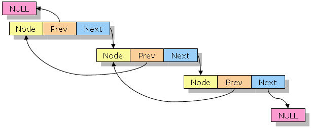

# Doubly Linked List

In computer science, a doubly linked list is a linked data structure that consists of a set of sequentially linked
records called nodes. Each node contains three fields: two link fields (references to the previous and to the next node
in the sequence of nodes) and one data field. The beginning and ending nodes' previous and next links, respectively,
point to some kind of terminator, typically a sentinel node or null, to facilitate traversal of the list. If there is 
only one sentinel node, then the list is circularly linked via the sentinel node. It can be conceptualized as two singly
linked lists formed from the same data items, but in opposite sequential orders.



## Contents

1. [Overview](#overview)
2. [Requirements](#requirements)
3. [Compilation and Usage](#compilation-and-usage)
4. [Known Issues](#known-issues)

## Overview

A simple program that creates and manipulates Linked Lists. This program will accept command line arguments.
The program will read data from a file and use that data to create and populate a linked list. It will then
filter the list by removing nodes from the list depending on the size of the data in the node, and parameters
which you pass in.

For the purpose of this assignment, the data is simply a txt file containing the dimension and values for an n x n 
matrix where each matrix represents a node in the linked list:

```text
7	7.3	6.0	5.5	0.0	4.2	7.8	0.6	7.6	6.9	6.3	5.5	8.4	3.7	0.6	9.0	8.9	0.3	4.5	8.8	2.1	6.4	1.4	0.4	3.1	3.1	6.9	3.4	2.6	0.4	9.7	9.8	1.6	3.9	5.8	6.8	1.2	1.4	5.2	7.0	1.4	4.9	3.4	5.7	2.3	5.3	9.3	5.8	2.4	3.9
2	6.2	8.0	9.2	9.3
9	6.1	6.0	1.8	5.8	6.4	7.1	6.8	4.8	7.3	4.7	2.6	2.7	7.4	1.3	5.8	1.8	4.3	6.1	8.6	2.2	9.3	8.5	3.3	9.5	1.0	0.0	2.0	6.0	7.6	0.4	6.5	2.5	6.8	0.5	6.1	5.4	8.9	1.3	5.6	4.9	6.9	3.0	0.5	5.0	5.3	2.3	5.8	0.2	6.7	3.2	5.3	0.1	5.0	1.1	6.3	9.7	6.6	6.5	4.8	8.6	8.0	6.0	5.6	0.2	4.9	8.1	5.8	0.9	2.1	0.8	8.1	4.2	6.3	7.8	1.0	5.1	4.0	2.4	2.1	5.4	3.3
1	8.7
5	8.6	3.0	7.4	5.4	5.1	5.4	7.2	2.5	6.0	4.5	8.8	5.1	7.9	8.8	4.7	7.1	9.6	5.4	6.2	5.0	4.4	5.0	8.3	4.2	6.2
2	8.1	7.0	8.1	3.7
9	8.4	0.5	5.2	5.3	9.1	1.5	8.4	7.8	0.7	1.2	9.6	3.0	2.5	0.1	2.2	1.8	7.4	5.0	0.2	9.6	6.3	0.0	7.9	3.1	5.9	0.5	7.1	4.9	6.2	3.8	6.6	8.4	6.1	7.4	9.0	5.8	1.3	5.1	3.3	4.6	1.7	3.1	4.3	4.0	2.5	8.2	1.3	4.9	1.8	9.8	2.3	8.2	4.7	1.9	1.1	9.7	7.6	8.9	5.9	4.3	6.6	9.3	3.2	7.6	8.1	8.7	1.9	5.9	9.3	9.8	6.5	7.6	1.3	5.9	1.9	3.7	8.5	8.2	4.1	6.3	6.9
5	6.2	4.7	2.3	5.9	3.5	0.6	3.8	5.0	5.7	7.3	1.3	2.0	7.2	6.6	0.9	0.5	2.8	0.3	5.4	5.0	7.9	2.2	9.5	6.8	9.4
7	6.8	8.2	7.5	4.5	3.1	4.3	1.4	1.8	7.6	5.2	4.9	4.3	8.2	9.1	3.6	4.4	5.7	9.0	5.8	4.5	9.0	2.2	3.9	6.1	0.5	1.1	0.4	7.3	7.9	3.0	7.0	1.2	1.2	4.0	8.8	8.8	1.9	8.1	8.8	9.4	2.4	8.2	1.4	1.1	7.3	2.8	6.8	1.4	6.5
1	1.6
```

However, Linked Lists can be used for other more complicated data structures; most notably a web browser cache which 
allows BACK-FORWARD pages, a music player which has next and prev buttons and any application which has a undo-redo 
functionality.

This program is particularly useful for those who wish to get accustomed to using pointers.

## Requirements

- gcc

## Compilation and Usage

To compile the code simply run the following command inside a terminal in the project directory:

```shell
make
```

The program has the following usage and default parameters:

```shell
Usage: ./main [-i <filename>] [-n <min_size>] [-x <max_size>] [-h (prints usage)]
Default: ./main [-i data.txt] [-n 0] [-x 1000] [-h]
```

Therefore, if you wish to run the program using the default parameters, simply run:

```shell
./main
```

Or alternatively, if you wish to filter the data in the linked list to remove all square matrices that are
bigger than 4 x 4, you may run the following command using command line arguments:

```shell
./main -i data.txt -n 0 -x 4
```

To clean up executables, run the following command:

```shell
make clean
```

## Results

Running the program with the default parameters:

```shell
./main
```

we get this output:

```shell
---------
Original Data
---------
7.30    6.00    5.50    0.00    4.20    7.80    0.60
7.60    6.90    6.30    5.50    8.40    3.70    0.60
9.00    8.90    0.30    4.50    8.80    2.10    6.40
1.40    0.40    3.10    3.10    6.90    3.40    2.60
0.40    9.70    9.80    1.60    3.90    5.80    6.80
1.20    1.40    5.20    7.00    1.40    4.90    3.40
5.70    2.30    5.30    9.30    5.80    2.40    3.90

6.20    8.00
9.20    9.30

6.10    6.00    1.80    5.80    6.40    7.10    6.80    4.80    7.30
4.70    2.60    2.70    7.40    1.30    5.80    1.80    4.30    6.10
8.60    2.20    9.30    8.50    3.30    9.50    1.00    0.00    2.00
6.00    7.60    0.40    6.50    2.50    6.80    0.50    6.10    5.40
8.90    1.30    5.60    4.90    6.90    3.00    0.50    5.00    5.30
2.30    5.80    0.20    6.70    3.20    5.30    0.10    5.00    1.10
6.30    9.70    6.60    6.50    4.80    8.60    8.00    6.00    5.60
0.20    4.90    8.10    5.80    0.90    2.10    0.80    8.10    4.20
6.30    7.80    1.00    5.10    4.00    2.40    2.10    5.40    3.30

8.70

8.60    3.00    7.40    5.40    5.10
5.40    7.20    2.50    6.00    4.50
8.80    5.10    7.90    8.80    4.70
7.10    9.60    5.40    6.20    5.00
4.40    5.00    8.30    4.20    6.20

8.10    7.00
8.10    3.70

8.40    0.50    5.20    5.30    9.10    1.50    8.40    7.80    0.70
1.20    9.60    3.00    2.50    0.10    2.20    1.80    7.40    5.00
0.20    9.60    6.30    0.00    7.90    3.10    5.90    0.50    7.10
4.90    6.20    3.80    6.60    8.40    6.10    7.40    9.00    5.80
1.30    5.10    3.30    4.60    1.70    3.10    4.30    4.00    2.50
8.20    1.30    4.90    1.80    9.80    2.30    8.20    4.70    1.90
1.10    9.70    7.60    8.90    5.90    4.30    6.60    9.30    3.20
7.60    8.10    8.70    1.90    5.90    9.30    9.80    6.50    7.60
1.30    5.90    1.90    3.70    8.50    8.20    4.10    6.30    6.90

6.20    4.70    2.30    5.90    3.50
0.60    3.80    5.00    5.70    7.30
1.30    2.00    7.20    6.60    0.90
0.50    2.80    0.30    5.40    5.00
7.90    2.20    9.50    6.80    9.40

6.80    8.20    7.50    4.50    3.10    4.30    1.40
1.80    7.60    5.20    4.90    4.30    8.20    9.10
3.60    4.40    5.70    9.00    5.80    4.50    9.00
2.20    3.90    6.10    0.50    1.10    0.40    7.30
7.90    3.00    7.00    1.20    1.20    4.00    8.80
8.80    1.90    8.10    8.80    9.40    2.40    8.20
1.40    1.10    7.30    2.80    6.80    1.40    6.50


---------
After Filtering
---------
7.30    6.00    5.50    0.00    4.20    7.80    0.60
7.60    6.90    6.30    5.50    8.40    3.70    0.60
9.00    8.90    0.30    4.50    8.80    2.10    6.40
1.40    0.40    3.10    3.10    6.90    3.40    2.60
0.40    9.70    9.80    1.60    3.90    5.80    6.80
1.20    1.40    5.20    7.00    1.40    4.90    3.40
5.70    2.30    5.30    9.30    5.80    2.40    3.90

6.20    8.00
9.20    9.30

6.10    6.00    1.80    5.80    6.40    7.10    6.80    4.80    7.30
4.70    2.60    2.70    7.40    1.30    5.80    1.80    4.30    6.10
8.60    2.20    9.30    8.50    3.30    9.50    1.00    0.00    2.00
6.00    7.60    0.40    6.50    2.50    6.80    0.50    6.10    5.40
8.90    1.30    5.60    4.90    6.90    3.00    0.50    5.00    5.30
2.30    5.80    0.20    6.70    3.20    5.30    0.10    5.00    1.10
6.30    9.70    6.60    6.50    4.80    8.60    8.00    6.00    5.60
0.20    4.90    8.10    5.80    0.90    2.10    0.80    8.10    4.20
6.30    7.80    1.00    5.10    4.00    2.40    2.10    5.40    3.30

8.70

8.60    3.00    7.40    5.40    5.10
5.40    7.20    2.50    6.00    4.50
8.80    5.10    7.90    8.80    4.70
7.10    9.60    5.40    6.20    5.00
4.40    5.00    8.30    4.20    6.20

8.10    7.00
8.10    3.70

8.40    0.50    5.20    5.30    9.10    1.50    8.40    7.80    0.70
1.20    9.60    3.00    2.50    0.10    2.20    1.80    7.40    5.00
0.20    9.60    6.30    0.00    7.90    3.10    5.90    0.50    7.10
4.90    6.20    3.80    6.60    8.40    6.10    7.40    9.00    5.80
1.30    5.10    3.30    4.60    1.70    3.10    4.30    4.00    2.50
8.20    1.30    4.90    1.80    9.80    2.30    8.20    4.70    1.90
1.10    9.70    7.60    8.90    5.90    4.30    6.60    9.30    3.20
7.60    8.10    8.70    1.90    5.90    9.30    9.80    6.50    7.60
1.30    5.90    1.90    3.70    8.50    8.20    4.10    6.30    6.90

6.20    4.70    2.30    5.90    3.50
0.60    3.80    5.00    5.70    7.30
1.30    2.00    7.20    6.60    0.90
0.50    2.80    0.30    5.40    5.00
7.90    2.20    9.50    6.80    9.40

6.80    8.20    7.50    4.50    3.10    4.30    1.40
1.80    7.60    5.20    4.90    4.30    8.20    9.10
3.60    4.40    5.70    9.00    5.80    4.50    9.00
2.20    3.90    6.10    0.50    1.10    0.40    7.30
7.90    3.00    7.00    1.20    1.20    4.00    8.80
8.80    1.90    8.10    8.80    9.40    2.40    8.20
1.40    1.10    7.30    2.80    6.80    1.40    6.50


```

However, we can filter the data in the linked list to remove any square matrices in the linked list that are bigger than
4 x 4:

```shell
./main -i data.txt -n 0 -x 4
```

Our output is:

```shell

---------
Original Data
---------
7.30    6.00    5.50    0.00    4.20    7.80    0.60
7.60    6.90    6.30    5.50    8.40    3.70    0.60
9.00    8.90    0.30    4.50    8.80    2.10    6.40
1.40    0.40    3.10    3.10    6.90    3.40    2.60
0.40    9.70    9.80    1.60    3.90    5.80    6.80
1.20    1.40    5.20    7.00    1.40    4.90    3.40
5.70    2.30    5.30    9.30    5.80    2.40    3.90

6.20    8.00
9.20    9.30

6.10    6.00    1.80    5.80    6.40    7.10    6.80    4.80    7.30
4.70    2.60    2.70    7.40    1.30    5.80    1.80    4.30    6.10
8.60    2.20    9.30    8.50    3.30    9.50    1.00    0.00    2.00
6.00    7.60    0.40    6.50    2.50    6.80    0.50    6.10    5.40
8.90    1.30    5.60    4.90    6.90    3.00    0.50    5.00    5.30
2.30    5.80    0.20    6.70    3.20    5.30    0.10    5.00    1.10
6.30    9.70    6.60    6.50    4.80    8.60    8.00    6.00    5.60
0.20    4.90    8.10    5.80    0.90    2.10    0.80    8.10    4.20
6.30    7.80    1.00    5.10    4.00    2.40    2.10    5.40    3.30

8.70

8.60    3.00    7.40    5.40    5.10
5.40    7.20    2.50    6.00    4.50
8.80    5.10    7.90    8.80    4.70
7.10    9.60    5.40    6.20    5.00
4.40    5.00    8.30    4.20    6.20

8.10    7.00
8.10    3.70

8.40    0.50    5.20    5.30    9.10    1.50    8.40    7.80    0.70
1.20    9.60    3.00    2.50    0.10    2.20    1.80    7.40    5.00
0.20    9.60    6.30    0.00    7.90    3.10    5.90    0.50    7.10
4.90    6.20    3.80    6.60    8.40    6.10    7.40    9.00    5.80
1.30    5.10    3.30    4.60    1.70    3.10    4.30    4.00    2.50
8.20    1.30    4.90    1.80    9.80    2.30    8.20    4.70    1.90
1.10    9.70    7.60    8.90    5.90    4.30    6.60    9.30    3.20
7.60    8.10    8.70    1.90    5.90    9.30    9.80    6.50    7.60
1.30    5.90    1.90    3.70    8.50    8.20    4.10    6.30    6.90

6.20    4.70    2.30    5.90    3.50
0.60    3.80    5.00    5.70    7.30
1.30    2.00    7.20    6.60    0.90
0.50    2.80    0.30    5.40    5.00
7.90    2.20    9.50    6.80    9.40

6.80    8.20    7.50    4.50    3.10    4.30    1.40
1.80    7.60    5.20    4.90    4.30    8.20    9.10
3.60    4.40    5.70    9.00    5.80    4.50    9.00
2.20    3.90    6.10    0.50    1.10    0.40    7.30
7.90    3.00    7.00    1.20    1.20    4.00    8.80
8.80    1.90    8.10    8.80    9.40    2.40    8.20
1.40    1.10    7.30    2.80    6.80    1.40    6.50


---------
After Filtering
---------
6.20    8.00
9.20    9.30

8.70

8.10    7.00
8.10    3.70

```

## Known Issues

None at present.
